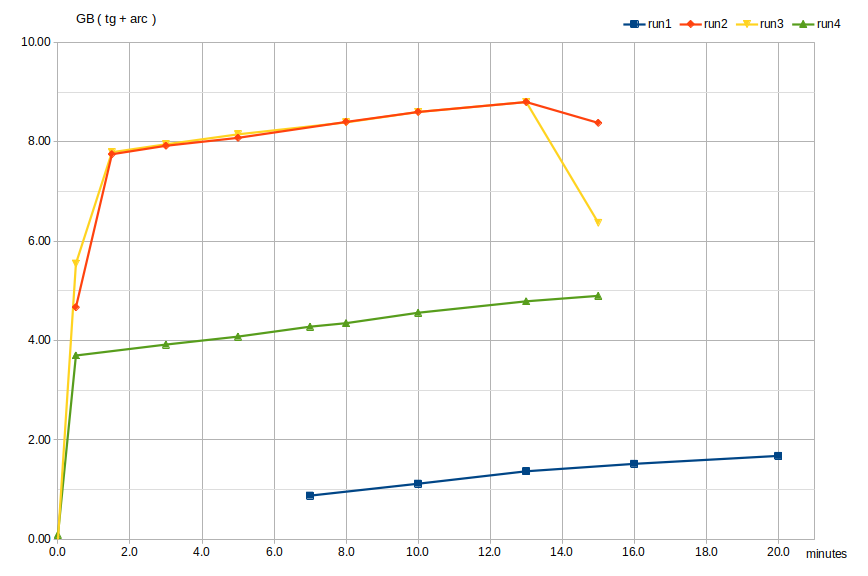
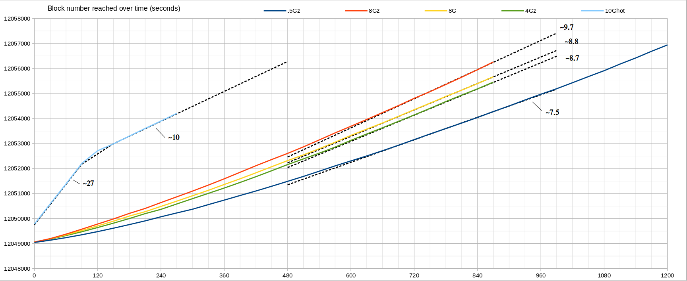

## Επίπτωση της cache του συστήματος αρχείων

Αυτή τη στιγμή έχω το turbo-geth σε ένα zfs partition σε δίσκο nvme, με ενεργοποιημένη συμπίεση (lz4).  
Το zfs κρατάει δικό του επίπεδο cache (τύπου [ARC](https://en.wikipedia.org/wiki/Adaptive_replacement_cache), στη RAM) το οποίο έχει configurable χαρακτιρηστικά (min/max size κ.α.) και μπορεί να κρατάει τα δεδομένα συμπιεσμένα ή ασυμπίεστα.  
Έβαλα το turbo-geth να κάνει συγχρονισμό πάνω στα ίδια block\*, με διαφορετικές παραμέτρους ARC σε κάθε run και κατέγραψα τα log και χρήση μνήμης.

\* αν το σταματήσεις μέσα σε 1 ώρα, δεν αποθηκεύει την πρόοδο του σταδίου Execution οπότε μπορείς να το ξανατρέξεις στα ίδια δεδομένα (καθαρίζοντας τις cache κάθε φορά)

### Χρήση μνήμης

Συνολική χρήση μνήμης του turbo-geth (tg) + της cache του zfs (arc) ως προς το χρόνο.
RunID | Cache size
------|-----------
run1  | 0.5Gz
run2  | 8Gz
run3  | 8G
run4  | 4Gz
run5  | 10G
run6  | 10G (no cache clear)

(..z == compression enabled)

To tg παίρνει περίπου 1-1.5GiB.

### Χρόνος εκτέλεσης

Από το log που βγάζει το tg, έχουμε κάθε 30 δευτ. τον αριθμό του block στο οποίο έχει φτάσει.

To 10Ghot είναι εκτέλεση που έγινε μετά αφότου σταμάτησε η προηγούμενη (arc 10GiB) χωρίς να καθαριστούν οι cache.  
Τα πρώτα λεπτά ήταν κυρίως cpu bound με ελάχιστο disk io.

Ενδιαφέρον έχει η απόδοση της 4Gz που είναι κοντά στην 8G.  
Από ένα σημείο και μετά (~8G), η αύξηση της cache δεν επιφέρει μεγάλη βελτίωση στο χρόνο εκτέλεσης, που σημαίνει ότι γίνονται μάλλον πολλά compulsory misses.  
Χρήσημα έιναι και τα στατιστικά της cache σε κάθε εκτέλεση. αρχεία arcstat και arc_summary στο φάκελο run4 (4Gz)  
πχ απ'το [run4/arcstats_rerun_5mins](run4/arcstats_rerun_5mins) έχουμε compression ratio: 5900642304 / 4107101184 = 1.4367  

