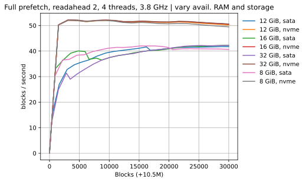
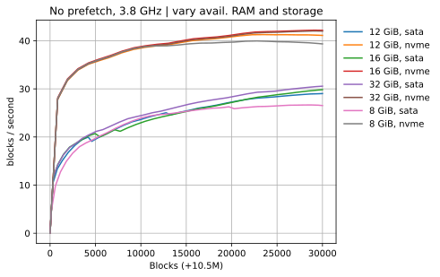
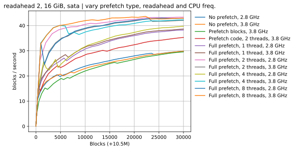
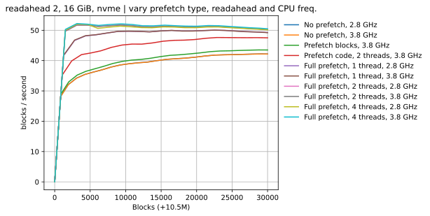
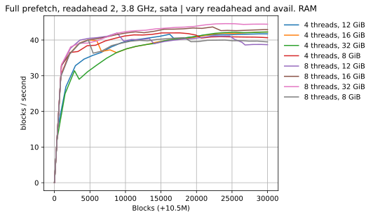
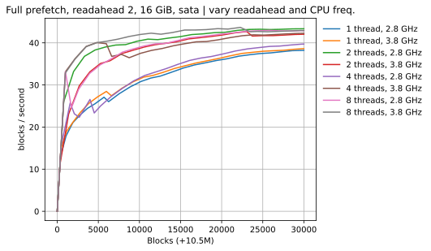
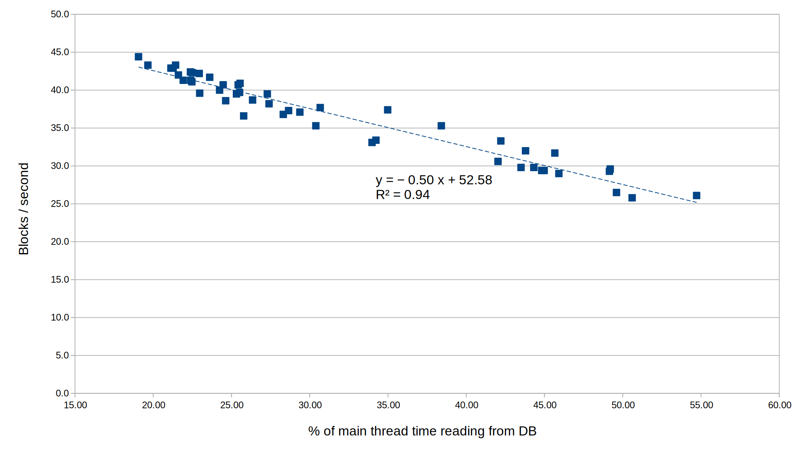

## Με ή χωρίς prefetch

Με | Χωρίς
---|------
 | 

## Sata vs Nvme

## Επίπτωση του πλήθους των prefetch threads

## Τελική επίδοση ως προς το ποσοστό του χρόνου που το execution thread ξοδεύει στη βάση

  
*αριστερά: περισσότερο prefetch, δεξιά: καθόλου*

## Όλες οι μετρήσεις μέχρι τώρα:
[Πίνακας με τελικές επιδόσεις](test.csv)
