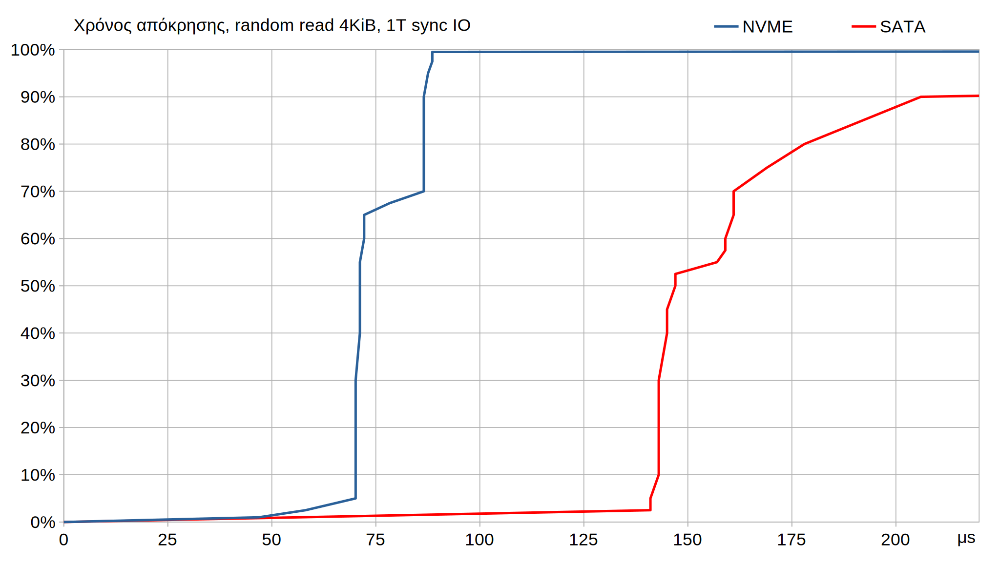

# Περιγραφή Benchmarking

Στο κεφάλαιο αυτό θα γίνει αναλυτική περιγραφή του εξοπλισμού και λογισμικού που θα χρησιμοποιηθεί
για την μέτρηση της επίδοση και αξιολόγηση του συστήματος, καθώς και τις μεθόδους που θα ακολουθηθούν
και παραμέτρους που θα εξεταστούν για την διεκπηραίωση των πειραμάτων και εξαγωγή των μετρήσεων.

## Εξοπλισμός

Οι μετρήσεις που πρόκυται να γίνουν μετρώνται εν μέρη σε χρόνο εκτέλεσης και εξαρτώνται σε μεγάλο βαθμό από
το υλισμικό (hardware) του συστήματος όπου εκτελούνται, γεγονός που θα επιβεβαιωθεί και στα αποτελέσματά τους, στο επόμενο κεφάλαιο.
Ακολουθεί η περιγραφή του hardware που χρησιμοποιήθηκε, με εξέταση των επιδόσεων (benchmarking) των συμαντικότερων κομματιών (components).

### Κύρια κομμάτια του υπολογιστή

###### Επεξεργαστής
Ο επεξεργαστής είναι το μοντέλο Ryzen 9 3900X της AMD.
Οι 12 φυσικοί πυρήνες του είναι οργανωμένοι σε 2 διαφορετικά τμήματα ημιαγωγού (semiconductor dies),
καθένα εκ των οποίων περιέχει 2 ομάδες πυρήνων (core complex - *CCX*) που μοιράζωνται την ίδια L3 cache μεγέθους 16 MiB.
Υποστηρίζει ταυτόχρονη πολυνηματική εκτέλεση (simultaneous multithreading - *SMT*) με 2 νήματα ανά πυρήνα (2-way SMT),
η οποία είναι ενεργοποιημένη σε όλες τις δοκιμές.
Το λειτουργικό σύστημα βλέπει 2 πυρήνες για κάθε ένα φυσικό πυρήνα και σε κάθε ζεύγος οι πυρήνες του θα λέγονται sibling cores.
Κάθε CCX επομένως έχει 3 φυσικούς πυρήνες και φαίνεται σαν να έχει 6.
Στο σχήμα 6.1 φαίνεται ο χρόνος απόκρισης μιας κατεύθυνσης (one-way latency) της επικοινωνίας μεταξύ όλων των πυρήνων:


Είναι προφανής η οργάνωση των πυρήνων σε ομάδες CCX καθώς και η αντιστοιχία των sibling cores.
Θα επιλέξουμε να περιορίσουμε όλες τις δοκιμές στους πυρήνες 3, 4 και 5 που ανήκουν στο ίδιο CCX (CCX1), μαζί
με τους sibling πυρήνες τους 15, 16, και 17 αντίστοιχα (σχήμα 6.2).


Το κύριο νήμα εκτέλεσης θα είναι περιορισμένο στον πυρήνα 3, ενώ τα υπόλοιπα στους 4, 5, 16, 17.
Ο sibling πυρήνας του 3 (ο 15) θα παραμένει κενός για να μην επιρρεάζεται η εκτέλεση του κύριου νήματος που βρίσκεται στον ίδιο φυσικό πυρήνα.
Ο περιορισμός των νημάτων στους πυρήνες στην γλώσσα go απαιτεί και το "κλείδωμα" των go-routines που περιέχουν τον κώδικα των νημάτων που αναφέρθηκαν,
σε μοναδικά δικά τους νήματα λειτουργικού (OS threads), διαφορετικά ο scheduler της go θα ήταν ελεύθερος να αλλάξει τη θέση τους [@LOCKOSTHREAD].
Ο περιορισμός των OS thread σε πυρήνες γίνεται με την κλήση συστήματος (system call) `sched_setaffinity` που είναι διαθέσιμη μέσω βιβλιοθήκης της go [@AFFINITY].
```go
func setCPU(cores ...int) {
    t := unix.CPUSet{}
    for _, core := range cores {
        t.Set(core)
    }
    unix.SchedSetaffinity(0, &t)
}
func lockThreadAndCPU(cores ...int) {
    runtime.LockOSThread() // Also needed for unique PID/TID, for perf-utils
    setCPU(cores...)
}
```
Ο garbage collector της go, μπορεί να χρησιμοποιήσει οποιουσδήποτε από τους 6 πυρήνες.
Σε κάθε περίπτωση, ολόκληρη η διεργασία του erigon (όλα τα νήματα) είναι περιορισμένη εξ' αρχής στους 6 αυτούς πυρήνες με τη χρήση του προγράμματος taskset [@TASKSET]:
```
taskset -c 3-5,16-17 ./build/bin/erigon ....
```

##### Κύρια μνήμη (RAM)
Η κύρια μνήμη αποτελείται από 2 DIMM DDR4 32 GiB το καθένα (μοντέλο TED432G3200C2201 της TEAM GROUP),
με ονομαστική συχνότητα ρολογιού 1600 MHz (3200 MT/s) και χρονισμούς κατά JEDEC DDR4-3200 (22-22-22-52).
Στις δοκιμές θα γίνουν αλλαγές τόσο στη συχνότητα ρολογιού όσο και στους χρονισμούς για τη διαπίστωση
πιθανής επίπτωσης της ταχύτητας μεταφοράς (memory bandwidth) και του χρόνου απόκρισης (memory latency).
Επίσης, δεν θα είναι διαθέσιμη ολόκληρη η μνήμη, αλλά αντιθέτως θα περιορίζεται η διαθέσιμη μνήμη πριν την
εκτέλεση του erigon σε διάφορα επίπεδα.
Για τον περιορισμό της διαθέσιμης μνήμης, ξεκινάει πρώτα μία άλλη διεργασία που δεσμεύει όσο ποσό μνήμης χρειάζεται ώστε
αυτή που υπολοίπεται να ισούται με το ποσό που ορίζει η κάθε δοκιμή. Ο κώδικας αυτής της διεργασίας είναι σε Python και βρίσκεται σε παράρτημα της εργασίας.
Η λειτουργία επέκτασης της φυσικής μνήμης χρησιμοποιώντας το δίσκο (swap) είναι απενεργοποιημένη.

##### Μέσα αποθήκευσης
Το λειτουργικό σύστημα, ο κώδικας του συστήματος και το εκτελέσιμο βρίσκονται όλα σε μία μονάδα SSD που δεν χρησιμοποιήται για κάποιον άλλο σκοπό.
Η βάση δεδομένων που περιλαμβάνει το *World State* καθώς και η βάση με τους peridictors βρίσκονται σε μία άλλη μονάδα SSD, που υπάρχει
αποκλειστικά για την αποθήκευση αυτών των βάσεων.
Ο erigon client κατά την εκτέλεσή του χρησιμοποιεί μόνο αυτές τις δύο βάσεις και επομένως μόνο στο μέσο αποθήκευση όπου βρίσκονται.
Ένα αντίγραφο και των δύο βάσεων βρίσκεται σε μία δεύτερη μονάδα SSD, διαφορετικών προδιαγραφών.

Η πρώτη μονάδα έχει διεπαφή PCI-express (προτόκολο NVME) ενώ η δεύτερη έχει SATA, και στο εξής θα αναφέρονται απλώς ως nvme και sata.

- O nvme είναι το μοντέλο SX8200 Pro της Adata, χωρητικότητας 2TB και είναι η έκδοση με τον ελεγτή SM2262EN της Silicon Motion,
μνήμη flash τύπου TLC (triple-level cells), διεπαφή PCI-Express v3 με 4 lanes, και είναι συνδεδεμένος στο PCIe bus του επξεργατή.

- Ο sata είναι το μοντέλο P210S2TB25 της Patriot, χωρητικότητας επίσης 2TB, με μνήμη flash τύπου QLC (quad-level cell),
διεπαφή SATA III και είναι συνδεδεμένος στο chipset X570 της μητρικής στο οποίο συνδέεται ο επεξεργαστής με διεπαφή PCIe v4 x4.

Στο σχήμα 6.3 αποτυπώνεται ο χρόνος απόκρισής τους σε αναγνώσεις, από δοκιμή με το πρόγραμμα `fio` με 1 thread και blocking, 4KiB random read I/O.
Είναι προφανές ότι ο χρόνος απόκρισής του sata είναι σημαντικά μεγαλύτερος από τον προηγούμενο, για τον οποίο λόγο επιλέχθηκε και γίνονται δοκιμές και στους δύο.



\FloatBarrier

## Μέθοδος δοκιμών

Οι δοκιμές γίνονται σε Ubuntu server 21.04 με kernel Linux 5.11.0-49-generic.
Πέραν του λειτουργιού και του SSH daemon, δεν τρέχουν άλλες διεργασίας ταυτόχρονα με τις δοκιμές.
Πριν κάθε εκτέλεση του erigon, άδειαζε η page cache του συστήματος:
```bash
echo 3 >/proc/sys/vm/drop_caches
```
Οι παράμετροι του κώδικα του erigon που αλλάζουν σε κάθε δοκιμή είναι compile-time σταθερές, και επομένως κάθε φορά γίνεται ξανά compile.
Ύστερα δεσμεύεται κύρια μνήμη ώστε τελικά η διαθέσιμη να ισούται με την επιθυμιτή.
Τέλος, εκτελείται ο erigon για το προκαθορισμένο πλήθος 30000 block.
Οι μετρήσεις χρόνου γίνονται όλες εσωτερικά του, με χρήση του μετρητή TSC του επεξεργαστή [@TSC]:
```
TEXT ·Measure(SB),NOSPLIT,$0-8
    RDTSCP
    LFENCE
    SHLQ    $32, DX
    ADDQ    DX, AX
    MOVQ    AX, ret+0(FP)
    RET
```
```go
func Tick(index int) {
    t := int64(Measure())
    atomic.AddInt64(&all_ticks[ index], t)
    atomic.AddInt64(&all_counts[index], 1)
}
const TSC_FREQ_100MHZ = 38 // 3.8 GHz
// ...
    return fmt.Sprintf("%14d %14d %14d",
        ((ticksA - ticksB) * 10) / (TSC_FREQ_100MHZ * countsA), // μέσος όρος
        countsA,                                                // πλήθος μετρήσεων
         (ticksA - ticksB)       / (TSC_FREQ_100MHZ * 100),     // συνολικός χρόνος
    )
// ...
```
Μετρήσεις γίνονται πριν και μετά την εκτέλεση ενός block (άρα αναμένεται το πλήθος ζευγών μετρήσεων να είναι 30000),
καθώς και σε άλλα σημεία, πχ στις αναγνώσεια από τη βάση.
Κρατάται ο συνολικός χρόνος.

## Ακρίβεια μετρήσεων

Για μια απλή εκτίμηση της άκρίβειας των μετρήσεων έγιναν 10 όμοιες δοκιμές με τον δίσκο sata και άλλες τόσες με τον nvme.
Η κάθε δοκιμή διαρκούσε περίπου 10 με 15 λεπτά.
Στο σχήμα 6.5 φαίνεται το ιστόγραμμα των ταχυτήτων εκτέλεσης.

\FloatBarrier

Εκτιμούμε την τυπική απόκλιση ως:
ΤΥΠΟΣ s

- Σχετική τυπική απόκλιση για τον sata: \quad $ s \approx 2,2\% $
- Σχετική τυπική απόκλιση για τον nvme: \quad $ s \approx 0,5\% $

Η πραγματική τιμή της τυπικής απόκλισης ενδέχεται να είναι μεγαλύτερη από την παραπάνω εκτίμηση.
