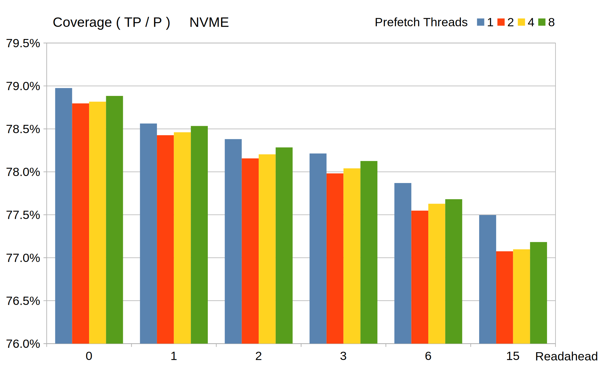
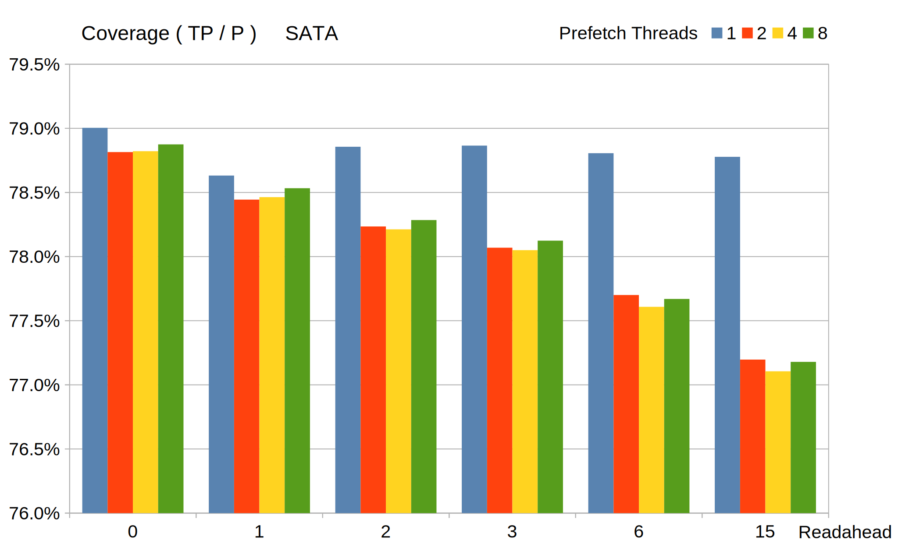
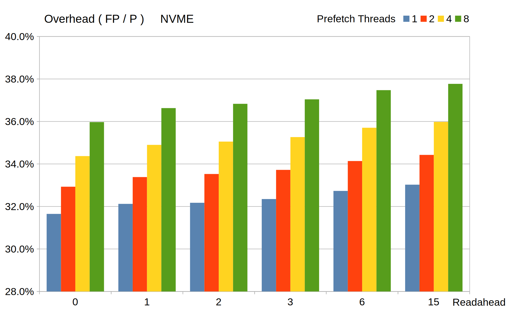
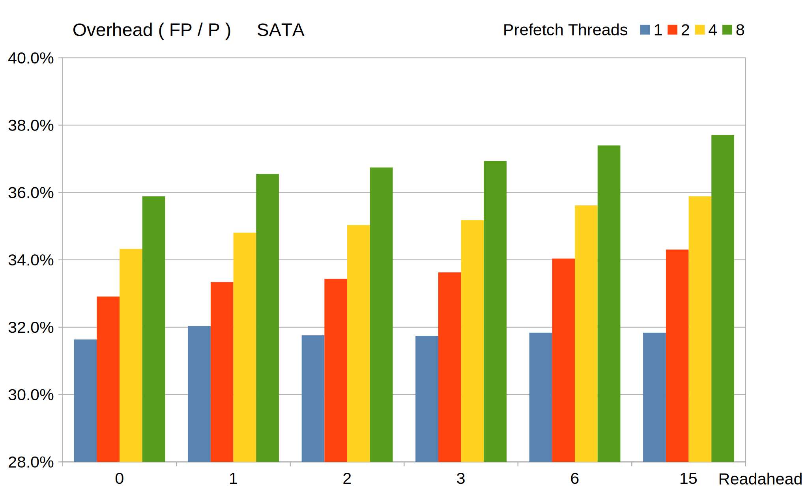
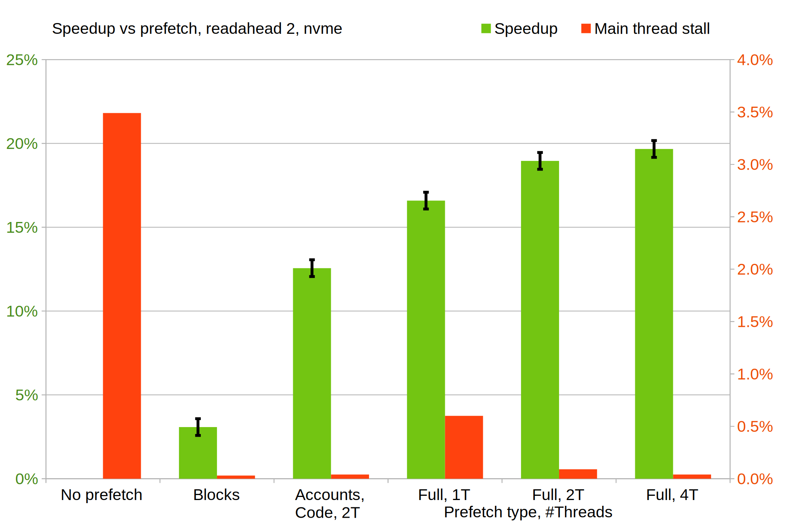
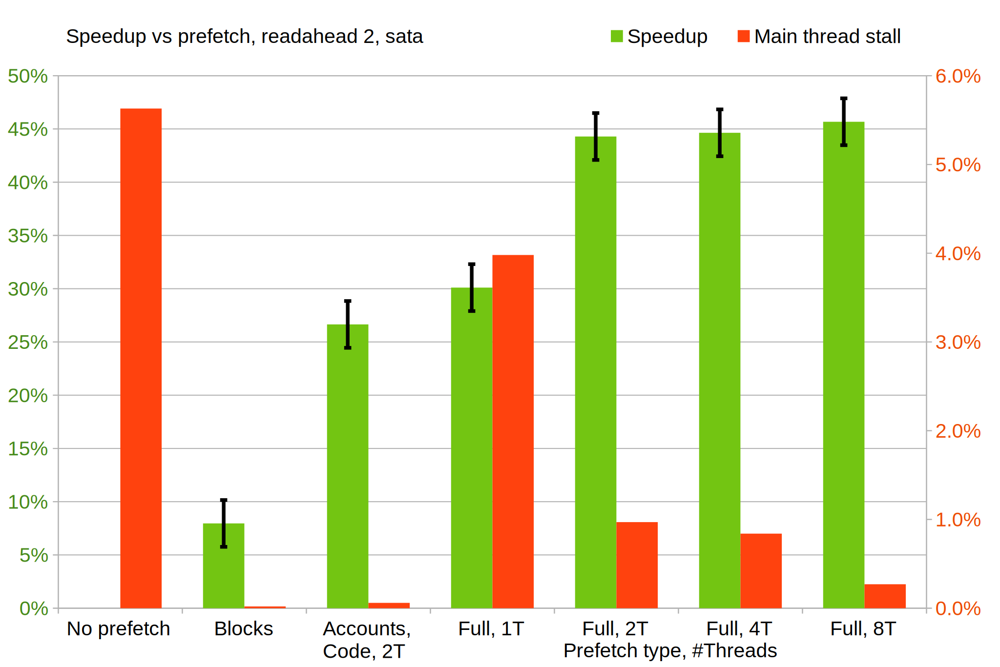
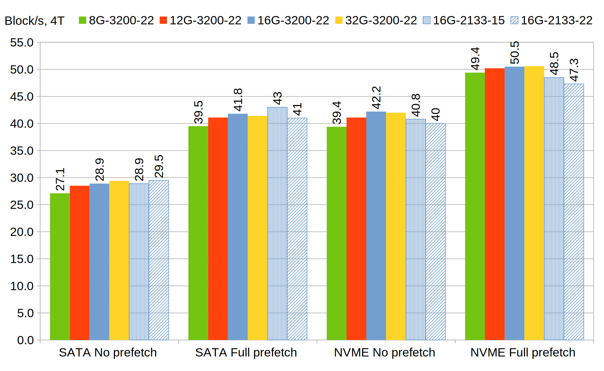
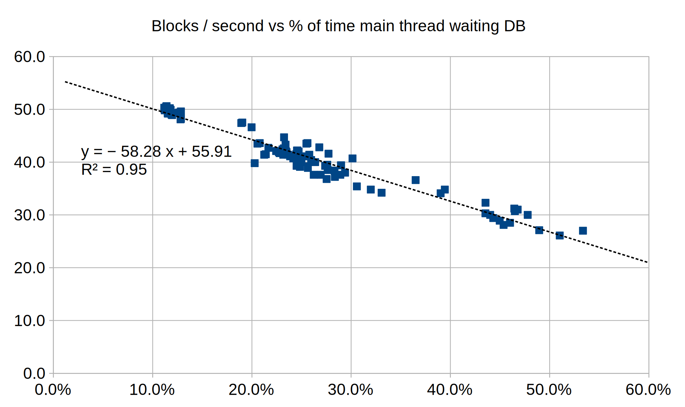
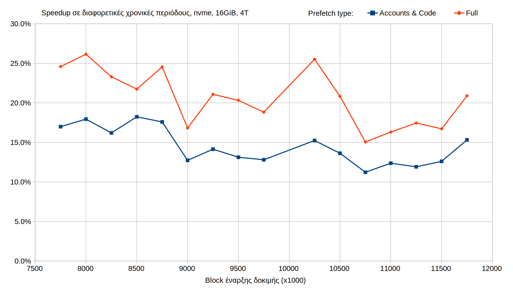

# Κεφ 7: Αποτελέσματα

## Ποσοστά επιτυχίας predictors

Για την αξιολόγηση των predictor ως προς τις διευθύνσεις τύπου storage τις οποίες προβλέπουν, ορίζουμε τις παρακάτω μετρικές:

- $ Coverage = TP / P $,  
όπου TP (True Positive) το πλήθος των διευθύσεων που προβλέπονται και όντως χρησιμοποιούνται στην πραγματική εκτέλεση  
και P (actual Positive) το πλήθος των διευθύσεων που χρησιμοποιούνται στην πραγματική εκτέλεση
- $ Overhead = FP / P $,  
όπου FP (False Positive) το πλήθος των διευθύσεων που προβλέπονται αλλά δεν χρησιμοποιούνται στην πραγματική εκτέλεση

Τα πλήθη διευθύνσεων μετρόνται ανά Transaction.
Μια διεύθυνση που χρησιμοποιήται 2 φορές στο ίδιο Transaction μετράει ως 1,
ενώ αν χρησιμοποιήται 2 φορές σε 2 διαφορετικά Transaction την κάθε φορά μετράει ως 2.

### Επίδραση του Readahead και του πλήθους νημάτων προανάκτησης

#### Coverage

##### με NVME

\FloatBarrier

##### με SATA

\FloatBarrier

#### Overhead

##### με NVME

\FloatBarrier

##### με SATA

\FloatBarrier

Μιας και το Readahead είναι ένα όριο (μέγιστο) και όχι επιβαλόμενο, όταν τα νήματα προανάκτησης αργούν,
η πραγματική απόσταση είναι μικρότερη από αυτό, με αποτέλεσμα η αύξησή του να μην επιφέρει κάποια πραγματική αλλαγή.

## Ταχύτητα εκτέλεσης

### Speedup σε τυπικές συνθήκες

Προσομοιάζουμε ένα "τυπικό" σύστημα αφήνοντας 16 GiB διαθέσιμη μνήμη, πλήθος πυρήνων όπως περιγράφηκε προηγουμένως,
τους χρονισμούς στις αναγραφόμενες τιμές τους, θέτουμε Readahead = 2 και δοκιμάζουμε στους 2 δίσκους,
ενεργοποιώντας περισσότερους τύπους προανάκτησης κάθε φορά:

##### με NVME

\FloatBarrier

##### με SATA

\FloatBarrier

Εδώ αναγράφεται και το "Main thread stall" δηλαδή ο χρόνος που το κύριο νήμα περιμένει το νήμα προανάγνωσης για να του
δώσει το επόμενο block. Αν τα νήματα προανάκτησης που τρέχουν τους predictor αργούν, τότε το κύριο αναγκάζεται να τα περιμένει.
Σε περίπτωση που δεν γίνεται καθόλου προανάκτηση, η τιμή αυτή αντιπροσωπεύει το χρόνο ανάγνωσης του block από το ίδιο το κύριο νήμα.

Βλέπουμε ότι και στις δύο περιπτώσεις υπάρχει σημαντική βελτίωση, με μεγαλύτερη σε κάθε περίπτωση στον - πιο αργό - SATA SSD.
Ακόμα και η σχετικά απλή προανάγνωση των block και προανάκτηση των λογαριασμών και κώδικα contract αποφέρει ένα μεγάλο μέρος του συνολικού speedup.
Αντιθέτως, η αύξηση του άριθμού των νημάτων πέραν των 2 δεν επιφέρει σημαντικές διαφορές.
Αυτό φαίνεται και από το "main thread stall" που είναι σχετικά μικρό σε αυτές τις περιπτώσεις.

### Επίδραση της κύριας μνήμης

Σε αυτές τις δοκιμές περιορίζεται η διαθέσιμη μνήμη σε διαφορετικά ποσά (8GiB, 12GiB, 16GiB, 32GiB),
καθώς και οι χρονισμοί της.
Συγκεκριμένα, στις όλες τις δοκιμές όπου δεν αναφέρεται, η συχνότητα ρολογιού της είναι 1600 MHz (ρυθμός μετάδοσής 3200MT/s)
και ο χρόνος απόκρισης (CAS latency) 22 κύκλοι (13,75 ns).
Γίνεται μια δοκιμή με συχνότητα 1067 MHz (2133 MT/s) και latency 15 κύκλους (14,0 ns).
Άλλη    μια δοκιμή με συχνότητα 1067 MHz (2133 MT/s) και latency 22 κύκλους (20,5 ns).

\FloatBarrier

Φαίνεται πως η επίδραση του μεγέθους της μνήμης είναι σχετικά μικρή (έως 7% +- 1%, "NVME No prefetch")
και γίνεται λιγότερο σημαντική με την προανάκτηση ενεργοποιημένη (2% +- 1%, "NVME Full prefetch"),
ιδιαίτερα στην περίπτωση του nvme.
Οι χρονισμοί της δεν φαίνεται να επιρρεάζουν στην περίπτωση του sata (δεδομένου και του σφάλματος μέτρησης),
ενώ έχουν μετρήσημη διαφορά (3% έως 7% +- 1%) με τον nvme.

### Επίδραση ταχύτητας CPU (TODO verify)

### Ταχύτητα εκτέλεσης | Ποσοστό χρόνου στη βάση δεδομένων

Σε όλες τις δοκιμές ^1 έχει συλλεχθεί και ο χρόνος που ξοδεύει το κύριο νήμα όσο βρίσκεται σε κώδικα της βάσης δεδομένων (MDBX).
Είναι ο χρόνος ανάγνωσης δεδομένων που δεν υπάρχουν στην write-cache.
Μπορούμε να ? plotαρουμε ? όλες τις δοκιμές σε ένα γράφημα σύγκρισης του χρόνου αυτού με την ταχύτητα εκτέλεσης (σχήμα 7.8).

\FloatBarrier

Όπως αναμέναμε υπάρχει πολύ στενή συσχέτηση των δύο μετρήσεων.
Επεκτείνωντας την ? trend line ?, εκτιμούμε άνω όριο της ταχύτητας που θα είχε το σύστημα με τέλεια προανάκτηση,
ως 56 block ανά δευτερόλεπτο, 11% μεγαλύτερη από την υψηλότερη μέτρηση ("NVME Full prefetch") και 33% από την αντίστοιχη χωρίς προανάκτηση.

### Δοκιμή σε άλλες χρονικές περιόδους

Όλες οι δοκιμές μέχρι εδώ έχουν γίνει ξεκινόντας από το block με αριθμό (block height) 10.500.000,
το οποίο αντιστοιχεί στα μέσα του Ιουλίου 2020, κατά την απότομη αύξηση σε transaction του 2020 [@TXCHART].
Οι δοκιμές με το δίσκο nvme επαναλήφθησαν για 15 ακόμα περιόδους από την άνοιξη του 2019 μέχρι του 2021.
Παρακάτω φαίνεται το speedup για 2 τύπος προανάκτησης, με το δίσκο nvme:

\FloatBarrier

Αν και υπάρχει μια ελαφρώς πτωτική τάση στη διάρκεια του 2019, η βελτίωση που παρέχει το σύστημα παραμένει
σχετικά σταθερή ως προς το χρόνο. Βέβαια, ο όγκος και σύνθεση των transaction διαφέρει ανά περίοδο [@TXCHART],
οπότε είναι αναμενόμενο ότι υπάρχουν διακυμάνσεις, ιδιαίτερα για την περίπτωση πλήρους προανάκτησης (full prefetch).

^1 εκτός από τις δοκιμές διαφορετικών χρονισμών μνήμης και χρονικών περιόδων (τελευταίες)
