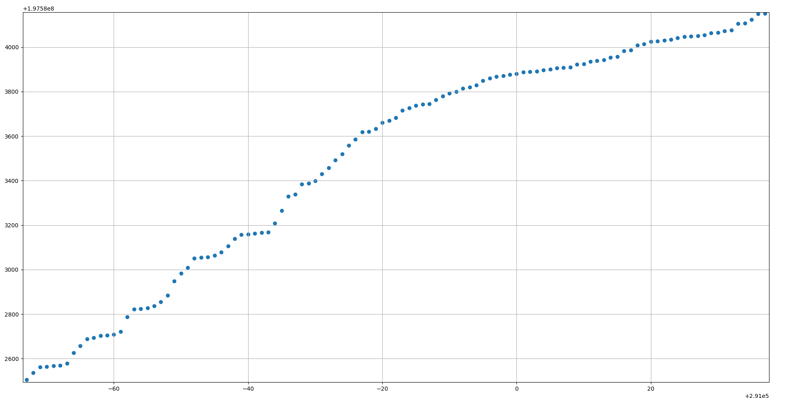

# Specifications
TODO

## Εκτέλεση/καταγραφή 3

Καταγραφή των synchronous writes στο σύστημα αρχείων (`vfs_write()`) κατά το Execution stage.

[Log](data/exec3.log)

#### Θέσεις εγγραφής

Οριζόντιος άξονας: αριθμός του request  
Κατακόρυφος: θέση στο vfs (σε block, 1 block = 4096 B)

zoom

zoom

zoom

#### Θέσεις εγγραφής ως προς χρόνο

Οριζόντιος άξονας: wall time (s)  
Κατακόρυφος: θέση στο vfs (σε block, 1 block = 4096 B)

zoom

zoom

#### Χρόνος σε εγγραφές ως προς συνολικό χρόνο

Οριζόντιος άξονας: wall time (s)  
Κατακόρυφος: time spent writing

zoom

zoom

zoom

